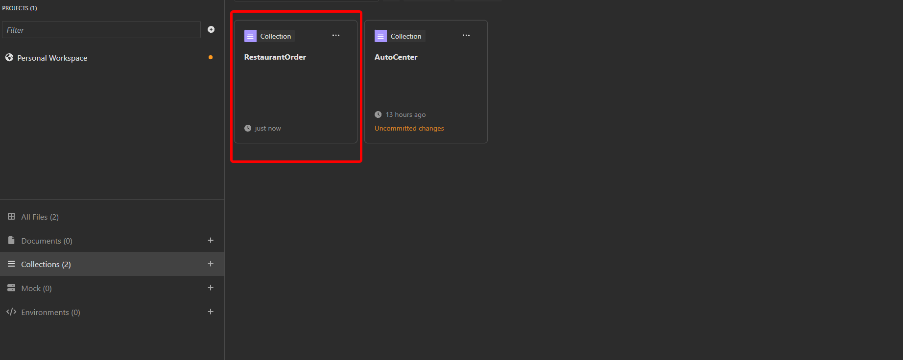

# Restaurant Order Routing System

## Overview

This project enables users to create orders, which are then routed to the appropriate sections of the kitchen.

## Used Libraries

- **Microsoft.AspNetCore.Authentication.JwtBearer**: JWT authentication for ASP.NET Core APIs.
- **Ocelot**: Library for creating API Gateways with routing and load balancing in microservices.
- **Microsoft.EntityFrameworkCore**: ORM for ASP.NET Core that simplifies queries in relational databases.
- **Microsoft.EntityFrameworkCore.InMemory**: In-memory database for Entity Framework Core.
- **RabbitMQ.Client**: RabbitMQ client for .NET, ideal for asynchronous communication in microservices.

## 🏗️ System Design


## 🧱 Main Functionality

The primary flow of this project is to enable the management of restaurant orders by routing them to specific sections in the kitchen. It allows users to create new orders, assign them to relevant kitchen stations such as fries, grills, salads, beverages, and desserts, and monitor their progress. This ensures a streamlined workflow within the kitchen, optimizing the preparation process for each type of order.

## How to use and test?

> [!WARNING]
> Requirements:
>
> - [Docker](https://docs.docker.com/get-started/get-docker/)
> - [Insomnia](https://insomnia.rest/download) or Postman
> - [Visual Studio Code](https://code.visualstudio.com/download) (optional)

To run the project, you just need to have Docker installed on your machine and extract the zipped project file:

> [!WARNING]
> It is important to note that in Docker Compose, we have environment variables with some test credentials to facilitate the execution of the project. If you plan to run this in a production environment, change the credentials specified in the "docker-compose.yml," or for better security, use Docker secrets to manage the credentials for each service (this improvement is mentioned in the future improvements section of this documentation).


Then, just open Docker to start the Docker engine, and then navigate to the project folder and open the terminal within that folder:


In the terminal, simply execute the command below to run the project:

```bash
docker-compose up --build
```

After that, Docker will start all the necessary containers to run each microservice of the project.

Next, we can test the project using Insomnia, Postman, or curl. In this documentation, I will use Insomnia. Therefore, you will first need to import the "RestaurantOrderInsomnia" JSON file into Insomnia.

To import, simply open Insomnia and click the import button:


Next, simply choose the "RestaurantOrderInsomnia" file, which is located inside the project folder:




With the test environment initialized, we need to log in to the authentication service, so simply follow the steps below:


It is necessary to copy the generated token to insert into the environment variables so that the other methods can use the token to validate the user's permissions:


After that, you can create the requests you want. We can start by creating an order:


Finally, we can test if the order went to the correct area of the kitchen:


## Future Improvements

- Docker secrets or secrets manager in cloud, to manage credentials needed in each service.
- Rate limit to API Gateway from excessive load.
- Integrate centralized logging and monitoring like prometheus.
- Apply a relational database.
- Create a library to manage models.

## Releases

| **Release** | **Scope**                             | **Status** | **Release Date**   |
| ----------- | ------------------------------------- | ---------- | ------------------ |
| 1.0.0       | Basic functionalities for the project | DONE       | 30 de out. de 2024 |
